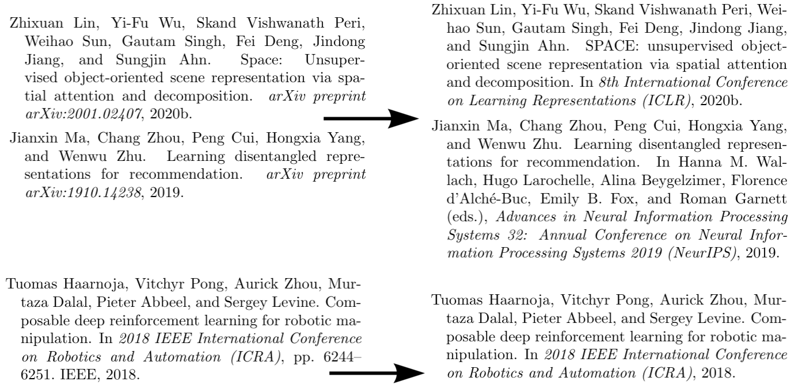

# latex_utils
Utils files to work with latex and publications


## 1. Automatically clean your bibliography
Use
`python3 clean_bibli.py` to clean bibliography.bib using data from [dblp](dblp.org) and [SemanticScholar](semanticscholar.org).

The script check if published versions are available, if so, download their bibtex, and removes useless fields (pages, ...etc) and replace the bibtex without changing the used key, such that you can directly use the generated cleaned bibliography.




## 2. Clean PDF folder
When (re)writing papers, the folder structure in which your main tex file is included can become *dirty*.
This script will create a cleaned version of your tex folder, compress (without loss) every PDF image that are included, and even hard compress the ones you want using ps2pdf linux command.

An example use of the script on my moc folder that contains `paper.tex`:
`python3 clean_pdf_folder.py moc --hard_compress moc/images/pcas moc/images/supplementary`
produces:
* a list of all tex file inserted in the main tex file 
```
Found included files, new extended tex files to be searched in:
['moc/paper.tex',
 'moc/supplementary_dev.tex',
 'moc/sections/introduction.tex',
 'moc/sections/method.tex',
 'moc/sections/experiments.tex',
 'moc/sections/related_work.tex',
 'moc/sections/conclusion.tex',
 'moc/supplements/embeddings_pca.tex',
 'moc/images/supplementary/ObjectGTTable.tex']
```
* a list of files that are used in these tex files (using `extensions=[".pdf", ".png", ".jpg", ".jpeg", ".eps"], l. 147`)
```
Finding these references to files (with their position in moc/paper.tex)
pos	 filename
2649 	 images/vulcan-salute.png
Finding these references to files (with their position in moc/supplementary_dev.tex)
pos	 filename
5740 	 images/supplementary/both_models.pdf
13071 	 images/motion_extraction2.pdf
28321 	 images/relevant_f_score_all_games.pdf
28897 	 images/precision_recall_curve_all_games.pdf
29562 	 images/relevant_few_shot_accuracy_with__all_games.pdf
30370 	 images/final_fsa1664.pdf
31299 	 images/final_fsa_and_ami_all_objects.pdf
32022 	 images/supplementary/models_qual_comp.pdf
44359 	 images/supplementary/iou.pdf
44644 	 images/supplementary/center-divergence.pdf
48401 	 img/Mutual_Information.pdf
The following files are commented, so are not going to be included:
--> file "{img/Mutual_Information.pdf}"
Finding these references to files (with their position in moc/sections/introduction.tex)
pos	 filename
1055 	 images/motivation_ecml.pdf
4113 	 images/tsne_and_fsa_ecml.pdf
Finding these references to files (with their position in moc/sections/method.tex)
pos	 filename
2262 	 images/model+moc_of.pdf
2329 	 images/moc.pdf
7840 	 images/Motion_influence.pdf
The following files are commented, so are not going to be included:
--> file "{images/Motion_influence.pdf}"
--> file "{images/model+moc_of.pdf}"
Finding these references to files (with their position in moc/sections/experiments.tex)
pos	 filename
2443 	 images/final_relevant_f_scores.pdf
2537 	 images/detection_scores.pdf
12688 	 images/both_ami_ecml.pdf
16453 	 images/evo_avg_fsa_emcl.pdf
The following files are commented, so are not going to be included:
--> file "{images/final_relevant_f_scores.pdf}"
Finding these references to files (with their position in moc/supplements/embeddings_pca.tex)
pos	 filename
507 	 images/pcas/air_raid_pca_relevant_cropped.pdf
869 	 images/pcas/boxing_pca_relevant_cropped.pdf
1224 	 images/pcas/carnival_pca_relevant_cropped.pdf
1588 	 images/pcas/mspacman_pca_relevant_cropped.pdf
1943 	 images/pcas/pong_pca_relevant_cropped.pdf
2300 	 images/pcas/riverraid_pca_relevant_cropped.pdf
2667 	 images/pcas/space_invaders_pca_relevant_cropped.pdf
3042 	 images/pcas/tennis_pca_relevant_cropped.pdf
```
* Moves the file (compress the PDFs) and Hard compress PDFS in folder given in `--hard_compress`
```
Moving files over to the new moc_cleaned
X  moc/images/pcas/boxing_pca_relevant_cropped.pdf (934.9KB) -> moc_cleaned/images/pcas/boxing_pca_relevant_cropped.pdf (316.0KB) (HARD compressed)
  moc/images/precision_recall_curve_all_games.pdf (1.9MB) -> moc_cleaned/images/precision_recall_curve_all_games.pdf (1.5MB) (compressed)
  moc/images/motivation_ecml.pdf (47.5KB) -> moc_cleaned/images/motivation_ecml.pdf (46.7KB) (compressed)
X  moc/images/pcas/tennis_pca_relevant_cropped.pdf (1.3MB) -> moc_cleaned/images/pcas/tennis_pca_relevant_cropped.pdf (350.6KB) (HARD compressed)
X  moc/images/pcas/pong_pca_relevant_cropped.pdf (788.1KB) -> moc_cleaned/images/pcas/pong_pca_relevant_cropped.pdf (289.4KB) (HARD compressed)
  moc/images/tsne_and_fsa_ecml.pdf (743.0KB) -> moc_cleaned/images/tsne_and_fsa_ecml.pdf (736.1KB) (compressed)
  moc/images/relevant_few_shot_accuracy_with__all_games.pdf (130.4KB) -> moc_cleaned/images/relevant_few_shot_accuracy_with__all_games.pdf (114.6KB) (compressed)
  moc/images/detection_scores.pdf (38.1KB) -> moc_cleaned/images/detection_scores.pdf (22.8KB) (compressed)
X  moc/images/pcas/mspacman_pca_relevant_cropped.pdf (1.0MB) -> moc_cleaned/images/pcas/mspacman_pca_relevant_cropped.pdf (282.5KB) (HARD compressed)
X  moc/images/supplementary/models_qual_comp.pdf (3.5MB) -> moc_cleaned/images/supplementary/models_qual_comp.pdf (564.3KB) (HARD compressed)
  moc/images/final_fsa1664.pdf (50.9KB) -> moc_cleaned/images/final_fsa1664.pdf (19.1KB) (compressed)
X  moc/images/pcas/riverraid_pca_relevant_cropped.pdf (1.4MB) -> moc_cleaned/images/pcas/riverraid_pca_relevant_cropped.pdf (326.2KB) (HARD compressed)
  moc/images/both_ami_ecml.pdf (37.3KB) -> moc_cleaned/images/both_ami_ecml.pdf (23.7KB) (compressed)
X  moc/images/pcas/carnival_pca_relevant_cropped.pdf (1.3MB) -> moc_cleaned/images/pcas/carnival_pca_relevant_cropped.pdf (311.8KB) (HARD compressed)
   moc/images/vulcan-salute.png -> moc_cleaned/images/vulcan-salute.png
  moc/images/moc.pdf (112.6KB) -> moc_cleaned/images/moc.pdf (107.0KB) (compressed)
  moc/images/motion_extraction2.pdf (66.9KB) -> moc_cleaned/images/motion_extraction2.pdf (64.8KB) (compressed)
X  moc/images/pcas/air_raid_pca_relevant_cropped.pdf (1.2MB) -> moc_cleaned/images/pcas/air_raid_pca_relevant_cropped.pdf (346.1KB) (HARD compressed)
  moc/images/supplementary/center-divergence.pdf (5.3KB) -> moc_cleaned/images/supplementary/center-divergence.pdf (5.0KB) (compressed)
  moc/images/supplementary/both_models.pdf (85.6KB) -> moc_cleaned/images/supplementary/both_models.pdf (81.4KB) (compressed)
  moc/images/relevant_f_score_all_games.pdf (103.5KB) -> moc_cleaned/images/relevant_f_score_all_games.pdf (94.3KB) (compressed)
  moc/images/final_fsa_and_ami_all_objects.pdf (31.8KB) -> moc_cleaned/images/final_fsa_and_ami_all_objects.pdf (15.8KB) (compressed)
  moc/images/supplementary/iou.pdf (4.9KB) -> moc_cleaned/images/supplementary/iou.pdf (4.5KB) (compressed)
X  moc/images/pcas/space_invaders_pca_relevant_cropped.pdf (2.0MB) -> moc_cleaned/images/pcas/space_invaders_pca_relevant_cropped.pdf (361.9KB) (HARD compressed)
  moc/images/evo_avg_fsa_emcl.pdf (27.5KB) -> moc_cleaned/images/evo_avg_fsa_emcl.pdf (18.3KB) (compressed)
```
* Copy over the rest of the files
```
Copying over :
  moc/paper.tex -> moc_cleaned/paper.tex
  moc/supplementary_dev.tex -> moc_cleaned/supplementary_dev.tex
  moc/sections/introduction.tex -> moc_cleaned/sections/introduction.tex
  moc/sections/method.tex -> moc_cleaned/sections/method.tex
  moc/sections/experiments.tex -> moc_cleaned/sections/experiments.tex
  moc/sections/related_work.tex -> moc_cleaned/sections/related_work.tex
  moc/sections/conclusion.tex -> moc_cleaned/sections/conclusion.tex
  moc/supplements/embeddings_pca.tex -> moc_cleaned/supplements/embeddings_pca.tex
  moc/supplements/073ObjectDetectionResults.tex -> moc_cleaned/supplements/073ObjectDetectionResults.tex
  moc/supplements/074ObjectConsistencyResults.tex -> moc_cleaned/supplements/074ObjectConsistencyResults.tex
  moc/images/supplementary/ObjectGTTable.tex -> moc_cleaned/images/supplementary/ObjectGTTable.tex
```
* Finally gives you a summary:
```
	Saved clean new repo in moc_cleaned
	Original folder size: 22.4MB
	New folder size:      6.2MB
```


## Bibtex cleaning
* check for duplicate

## Rest
* Create pandas table from latex and vice versa
